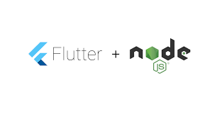
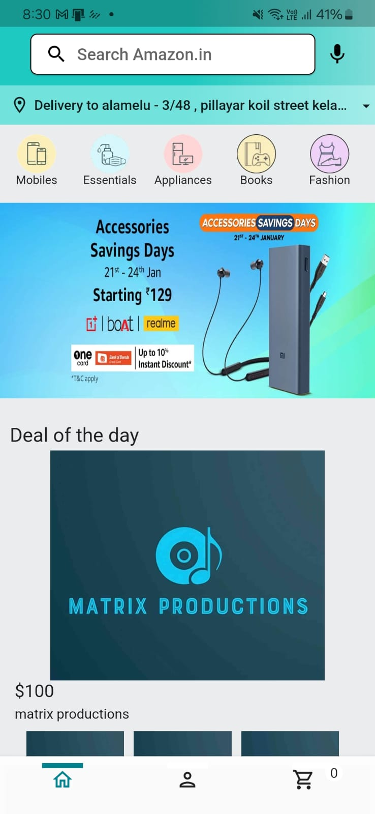
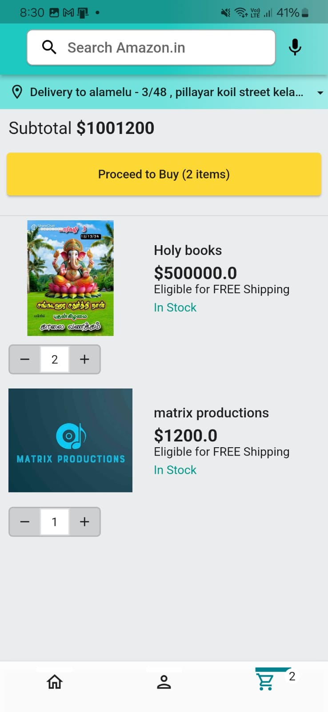
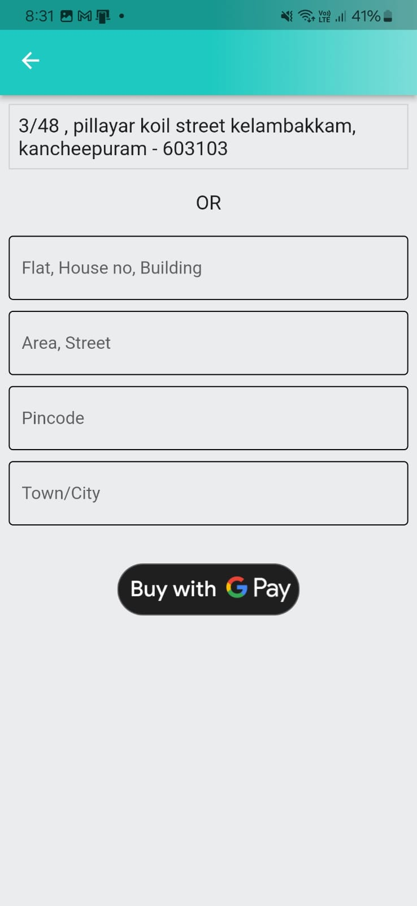
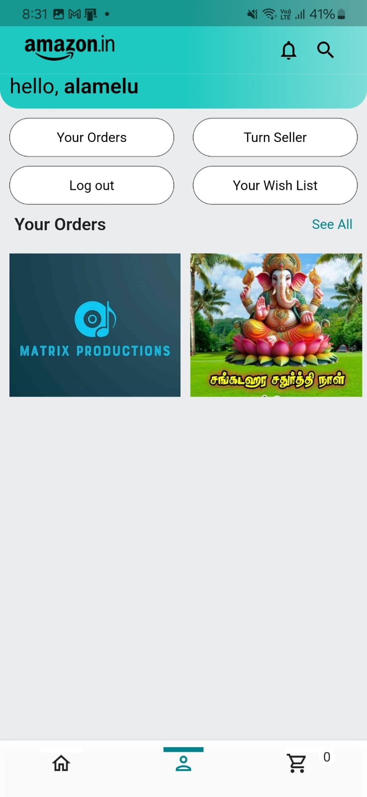
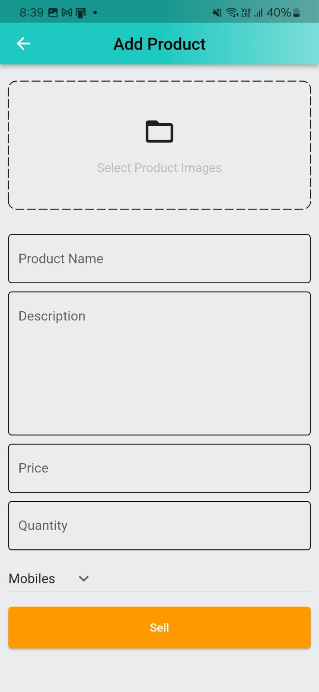
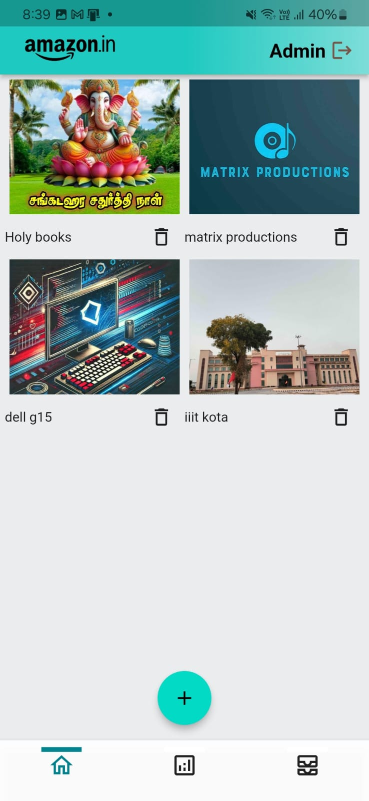
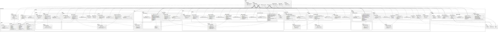

Certainly! Here's the README file with proper formatting, bold text, and image uploading syntax included:

---

# **Full-Stack Amazon-Clone App**
<p align="center">

</p>
This is a **full-stack e-commerce application** built to replicate the core features of Amazon, developed using **Flutter** for the frontend and **Node.js** for the backend. The app allows users to browse products, manage their cart, place orders, and make payments securely. It also includes an **admin dashboard** to manage product listings, orders, and track profits.

---

## **Features**

### **User Features**
- **User Authentication:** Secure login and registration with session management.
- **Product Listings:** Dynamic catalog fetched from APIs.
- **Search Functionality:** Advanced search using **regex** to filter products.
- **Cart Management:** Add, remove, and view items in the cart.
- **Order Management:** Place orders and track order status in real-time.
- **Deals of the Day:** Display products based on ratings and performance.
- **Rating Management:** Users can rate products, influencing deals and visibility.
- **Payment Integration:** Seamless payment through **Google Pay** and **Apple Pay**.

### **Admin Features**
- **Product Management:** Admin can add/update/delete products and manage inventory.
- **Order Management:** View and update order statuses.
- **Profit Analysis:** Admin dashboard with charts displaying profit data and products sold.
- **Admin Dashboard:** Intuitive UI to manage the app’s functionalities.

---

## **Tech Stack**

- **Frontend:** Flutter for building cross-platform mobile applications.
- **Backend:** Node.js with **Express** to build a robust REST API.
- **Database:** MongoDB for storing product, user, and order data securely.
- **Image Hosting:** **Cloudinary** for image management and hosting.
- **Hosting:** APIs deployed on **Render** for scalability and uptime.

---

## **Project Architecture**

The app follows a **feature-first architecture** ensuring modularity and scalability:

- **Feature Modules:** Independent modules for authentication, cart, orders, product management, etc.
- **Reusable Components:** Common UI elements for a consistent look and feel.
- **State Management:** Organized using the **Provider** package for better performance.
- **Service Layer:** Abstracts API calls to ensure code reusability.

---

## **Installation**

### **Prerequisites**

Before you can run this project locally, you need to have the following installed:

- [Flutter](https://flutter.dev/docs/get-started/install)
- [Node.js](https://nodejs.org/en/)
- [MongoDB](https://www.mongodb.com/)
- [Git](https://git-scm.com/)

### **Steps to Run Locally**

1. Clone this repository to your local machine:

   ```bash
   git clone https://github.com/yourusername/amazon-clone.git
   cd amazon-clone
   ```

2. **Frontend:**
   - Run the Flutter app:
     ```bash
     flutter run
     ```

3. **Backend:**
   - Navigate to the `backend` directory and install dependencies:
     ```bash
     cd server
     npm install
     ```
   - Create a `.env` file in the backend directory and configure your environment variables (e.g., database connection URI, API keys).
   - Start the backend server:
     ```bash
     npm start
     ```

4. **Database:**
   - Set up your **MongoDB** instance (you can use **MongoDB Atlas** for cloud hosting).
   - Import necessary seed data or set up your own in the database.

5. **Cloud Hosting:**
   - Set up **Cloudinary** and obtain the required API credentials for image hosting.

---

## **Usage**

- Open the app on your mobile device and start browsing products, adding them to the cart, and making purchases.
- Admin can manage the system through the **admin dashboard** available in the app, allowing for real-time tracking of products and orders.

---

## **Showcase**

Here are some images from the app:

<div style="display: flex; overflow-x: auto; gap: 10px;">
  
  
  
  
  
  
  <!-- Add more images as needed -->
</div>


---

## **Showcase: SVG Class Diagram**

<p align="center">
  
</p>
<p align="center">
  Class diagram illustrating the architecture and relationships within the Flutter app.
</p>

---

## **Contributing**

Contributions are welcome! Please fork the repository, create a new branch for your feature or fix, and submit a pull request.

---

## **License**

This project is licensed under the **MIT License** - see the [LICENSE](LICENSE) file for details.

---

